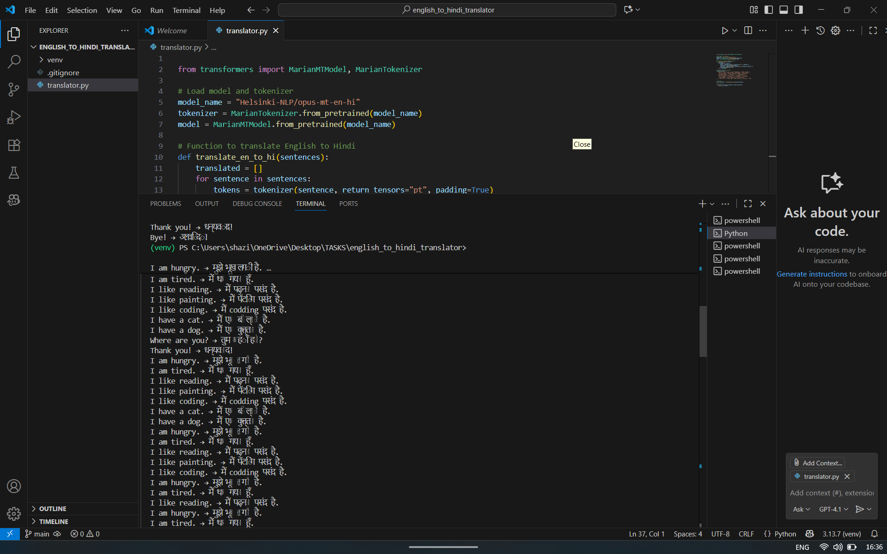

# English to Hindi Translator

This is a simple **English → Hindi language translator** built using a **Hugging Face pretrained model** (`Helsinki-NLP/opus-mt-en-hi`).  
It takes 30 English sentences and translates them into Hindi.

---

## 📌 Features
- Uses Hugging Face `transformers` library
- Translates English text to Hindi
- Beginner-friendly and lightweight

---

## 🛠️ Tech Stack

### Programming Language
- **Python 3.x** - Core programming language used for the entire project

### Libraries and Frameworks

1. **Transformers (Hugging Face)**
   - Purpose: Provides access to pre-trained NLP models
   - Specific model used: `Helsinki-NLP/opus-mt-en-hi`
   - Why: This library simplifies the implementation of state-of-the-art translation models without requiring extensive training

2. **MarianMT Model**
   - A neural machine translation model specifically trained for English to Hindi translation
   - Part of the OPUS-MT project (Open Parallel Corpus - Machine Translation)
   - Advantage: Optimized for translation tasks with high accuracy

3. **MarianTokenizer**
   - Preprocesses input text by converting it into tokens that the model can understand
   - Handles special characters and maintains context

## ⚙️ Installation & Usage

1. Clone this repository:
   ```bash
   git clone https://github.com/shazia-16/english-to-hindi-translator.git
   cd english-to-hindi-translator

2. Create virtual environment (optional but recommended):
python -m venv venv
venv\Scripts\activate      # for Windows

3. Install dependencies:
pip install torch transformers sentencepiece

4. Run the translator:
python translator.py

## 📸 Example Output

Here is a sample screenshot of the translator in action:




### How It Works

1. **Model Initialization**
```python
   model_name = "Helsinki-NLP/opus-mt-en-hi"
   tokenizer = MarianTokenizer.from_pretrained(model_name)
   model = MarianMTModel.from_pretrained(model_name)

Specifies the model name for easy reference
Loads the pre-trained MarianTokenizer and MarianMTModel


Translation Function

python
def translate_en_to_hi(sentences):
       translated = []
       for sentence in sentences:
           tokens = tokenizer(sentence, return_tensors="pt", padding=True)
           translation = model.generate(**tokens)
           hindi_text = tokenizer.decode(translation[0], skip_special_tokens=True)
           translated.append(hindi_text)
       return translated

Function Purpose: Takes a list of English sentences and returns Hindi translations
Tokenization: Converts each sentence into PyTorch tensors with padding
Generation: Model produces translation tokens
Decoding: Converts tokens back to readable Hindi text (removing special tokens)
Batch Processing: Loops through all sentences and stores translations


Input Data

30 predefined English sentences in a list
Covers diverse contexts: greetings, emotions, questions, statements, hobbies
Examples: "Hello!", "How are you?", "I love programming.", "My name is Shazia."


Translation Execution

python
hindi_translations = translate_en_to_hi(english_sentences)

Calls the translation function with the list of English sentences
Returns a list of Hindi translations in the same order


Output Display

python
for en, hi in zip(english_sentences, hindi_translations):
       print(f"{en} → {hi}")

Uses zip() to pair each English sentence with its Hindi translation
Displays in format: English sentence → हिंदी अनुवाद
Arrow (→) separator for clear visualization

Key Features

✅ Custom translation function for reusability
✅ Batch processing of 30 sentences
✅ PyTorch tensor-based processing
✅ Automatic padding for consistent input sizes
✅ Context-aware translation
✅ Handles various sentence structures (questions, statements, exclamations)
✅ Clean and readable output format with arrow separator
